# Architecture & Decisions

This document captures the technical decisions behind the site and why they were made.

## Goals

The site is the canonical web presence for the **GhostKellz GPG identity**. Its job is narrow
and important: let anyone fetch and verify the official public key with confidence. The
priorities, in order, are:

1. **Verifiability** — the published key, fingerprint, and WKD lookup must be trustworthy and
   easy to confirm against an independent source.
2. **Fast page loads** — a single static page that renders instantly with minimal JavaScript.
3. **Low operating cost / low maintenance** — no application server, no database, no CMS to
   patch.
4. **Clear presentation** — terminal-style framing that mirrors how the key is actually used
   on the command line.

## Key Decisions

### Static site generation with Astro

**Decision:** Use [Astro](https://astro.build) 6.x with static output.

**Why:** Astro ships zero JavaScript by default and renders to plain HTML/CSS at build time.
For a single-page identity site this is ideal — the page loads instantly and the output is
trivially cacheable at the edge. Astro's component model (`.astro` files) keeps markup, scoped
styles, and small bits of logic together (the key block, terminal, and GhostFetch card) without
pulling in a full client framework.

**Trade-off:** Anything genuinely dynamic must be handled by a sprinkle of client JS. For this
site the only interactivity is copy-to-clipboard, the collapsible key block, and the terminal
replay — all handled by Alpine.

### Tailwind CSS 4 (CSS-first)

**Decision:** Use [Tailwind CSS 4](https://tailwindcss.com) via the official
`@tailwindcss/vite` plugin, with the theme defined CSS-first in `src/styles/global.css`.

**Why:** Tailwind 4 moves configuration into CSS through the `@theme` block. The GhostKellz
palette (`--color-ghost-bg`, `--color-ghost-cyan`, `--color-ghost-glow`, etc.), the mono font
stack, and custom keyframes (`pulse-glow`, `typing`, `blink`) all live in `global.css`, so the
dark neon look is expressed once and reused as utility classes (`bg-ghost-bg`,
`text-ghost-cyan`). A legacy `tailwind.config.mjs` is retained for compatibility/documentation
only; the active configuration is the CSS-first `@theme`.

**Trade-off:** The CSS-first model differs from the Tailwind 3 + `tailwind.config.js` approach
used by some older CK sites. See [design-system.md](design-system.md).

### Alpine.js for interactivity

**Decision:** Use [Alpine.js](https://alpinejs.dev) 3, initialized once in the layout.

**Why:** The site needs only small, declarative interactions: copy buttons, toggling the full
key block (`x-data`/`x-show`), and the auto-replaying terminal animation. Alpine provides this
inline in the markup with a tiny footprint. It is imported and started once in
`Layout.astro` (`Alpine.start()`), so every component can use `x-data` directives.

**Trade-off:** Alpine is bundled rather than CDN-loaded, which keeps it self-hosted and
versioned with the project (`alpinejs ^3.15.12`).

### npm as the package manager

**Decision:** Use **npm** with a committed `package-lock.json`.

**Why:** This project standardizes on npm for reproducible installs (`npm ci` in any
automated context). The lockfile pins the exact dependency tree. Note this differs from some
sibling sites that use pnpm — commands here are `npm run …`.

### Vite 7 as the build tool

**Decision:** Astro's Vite-based pipeline with Vite 7 and the Tailwind Vite plugin.

**Why:** Vite provides the dev server, HMR, and the production bundling Astro builds on. The
only Vite plugin configured is `@tailwindcss/vite` (see `astro.config.mjs`).

### NGINX for hosting

**Decision:** Serve the built `dist/` directory as static files behind NGINX over HTTPS on a
PVE1 NGINX VM, fronted by Cloudflare.

**Why:** Static files behind NGINX are about as fast, cheap, and secure as web hosting gets —
no runtime to exploit or patch. NGINX also handles the HTTP→HTTPS redirect, long-lived caching
for hashed Astro assets, security headers, and the special handling the GPG identity needs: the
**WKD `/.well-known/openpgpkey/` location** (binary key, `application/octet-stream`, permissive
CORS) and the **`.asc` download** handling. See [deployment.md](deployment.md).

### Cloudflare (standard / free plan) at the edge

**Decision:** Front the origin with Cloudflare on the **standard free plan**.

**Why:** Cloudflare provides proxied DNS, edge TLS, a managed WAF ruleset, basic rate limiting,
bot controls, and HTTP/3 / Brotli at no cost — appropriate for a small, public, static identity
site. Pro-only features (Argo, tiered cache, advanced WAF) are intentionally **not** used here.
See [cloudflare.md](cloudflare.md).

## Resulting Architecture

```mermaid
%%{init: {'theme':'base','themeVariables':{'fontFamily':'JetBrains Mono, ui-monospace, monospace','primaryColor':'#12121a','primaryBorderColor':'#4fd1c5','primaryTextColor':'#e0e0e0','lineColor':'#38b2ac','fontSize':'14px'}}}%%
flowchart LR
    SRC["Author .astro<br/>page + components"]:::dev
    BUILD["astro build · Vite 7"]:::dev
    DIST["dist/<br/>static HTML/CSS/JS"]:::dev
    NGX["PVE1 NGINX VM<br/>ghostkellz.sh · www"]:::host
    CF["Cloudflare edge<br/>free plan"]:::edge
    USER(["Visitors · HTTPS"]):::public
    GPG["GPG clients<br/>WKD / .asc import"]:::external

    SRC --> BUILD --> DIST
    DIST ==>|"tar.gz + rclone<br/>over Tailscale"| NGX
    NGX --> CF --> USER
    CF -.->|"WKD + .asc passthrough"| GPG

    classDef dev fill:#12121a,stroke:#4fd1c5,stroke-width:1.5px,color:#e0e0e0;
    classDef host fill:#1e1e2e,stroke:#4fd1c5,stroke-width:1.5px,color:#e0e0e0;
    classDef edge fill:#1e1e2e,stroke:#38b2ac,stroke-width:1.5px,color:#64ffda;
    classDef public fill:#0a0a12,stroke:#888899,stroke-width:1.5px,color:#e0e0e0;
    classDef external fill:#1e1e2e,stroke:#F59E0B,stroke-width:1.5px,color:#F59E0B;
```

No database, no application server, no server-side runtime to maintain. The origin is locked
down behind Tailscale (key-based SSH only, port 22 not public), TLS is automated with acme.sh +
Let's Encrypt (Cloudflare DNS-01), and the public edge is Cloudflare on the free plan. See
[deployment.md](deployment.md) for the full pipeline, [security.md](security.md) for the
network posture and CrowdSec setup, [cloudflare.md](cloudflare.md) for the edge, and
[gpg.md](gpg.md) for how the key itself is published and verified.
