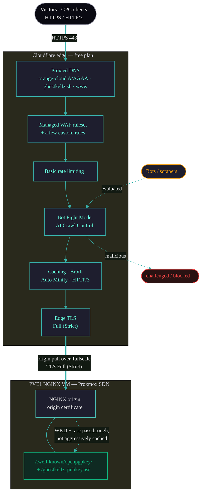

# Cloudflare Edge

`ghostkellz.sh` sits behind **Cloudflare on the standard (free) plan**. This document covers
what is actually in use: proxied DNS, edge TLS to the NGINX origin, the free-tier WAF and rate
limiting, bot controls, caching/speed features, and the one caching caveat that matters for an
identity site — the `.well-known` / WKD path.

> **Plan scope.** This site runs the **free plan**. Pro/Business-only features — **Argo Smart
> Routing, tiered cache, and advanced/custom WAF managed rulesets** — are **not** in use here,
> unlike the cktechx / ckelley properties. Everything documented below is available on the free
> tier.

## Edge Topology

## Proxied DNS (orange cloud)

`ghostkellz.sh` and `www.ghostkellz.sh` are **proxied** (orange-cloud) `A`/`AAAA` records.
Visitor traffic terminates at the Cloudflare edge, which then pulls from the NGINX origin on the
PVE1 VM. The origin IP is never exposed directly; the origin pull rides the private path (the
origin is reachable over Tailscale and protected by the PVE firewall, default-deny except 443 —
see [security.md](security.md#trust-planes)).

## WAF, Firewall Rules & Rate Limiting (free tier)

- **Managed WAF ruleset** — Cloudflare's free managed ruleset handles common web exploits.
- **A few custom firewall rules** — narrow allow/deny rules appropriate to a static identity
  site (e.g. method restrictions, obvious-abuse patterns).
- **Basic rate limiting** — free-tier rate limiting to blunt floods against the origin.

Advanced/custom WAF managed rulesets (a Pro+ feature) are **not** configured here.

## Bot Controls

- **Bot Fight Mode** — the free-tier bot mitigation that challenges automated abuse.
- **AI Crawl Control** — free-tier controls over AI crawlers.

These run at the edge before traffic reaches the origin, so scrapers and abusive automation are
challenged or dropped without consuming origin resources.

## Caching & Speed (free tier)

Available and enabled on the free plan:

- **Standard caching** of static assets.
- **Brotli** compression.
- **Auto Minify** for eligible assets.
- **HTTP/3 (QUIC)** to visitors.

Because the site is small and fully static, these features give fast global delivery at no cost.
Pro-only acceleration (Argo Smart Routing, tiered cache) is **not** used.

## Caching & the `.well-known` Path

This is the one caching detail that matters for an identity site. The GPG artifacts must always
reflect the **currently published** key:

- `/.well-known/openpgpkey/hu/<hash>` (the WKD binary key)
- `/ghostkellz_pubkey.asc` (the armored download)

Guidance:

- Do **not** cache these aggressively. Let them pass through to the origin (or use a short edge
  TTL) so a renewed key is served immediately, and so the origin's
  `application/octet-stream` + `Access-Control-Allow-Origin: *` headers (for WKD) and
  `text/plain` + `Content-Disposition: attachment` headers (for `.asc`) reach the client intact.
  See [deployment.md](deployment.md#nginx-configuration).
- After any **key renewal/redeploy**, **purge the Cloudflare cache** for these two paths so
  visitors and GPG clients fetch the new key rather than a stale edge copy. See the renewal
  steps in [gpg.md](gpg.md#renewal-procedure).

A Cache Rule (or a page-level "Bypass cache" rule) scoped to `/.well-known/openpgpkey/*` and
`*.asc` is the simplest way to guarantee correct passthrough on the free plan.

## TLS & Origin Certificate

- **Edge TLS:** **Full (Strict)** — Cloudflare validates the origin's certificate, so the leg
  from Cloudflare to NGINX is encrypted **and** authenticated end-to-end.
- **Origin certificate:** the same Let's Encrypt certificate NGINX serves
  (`/etc/nginx/certs/ghostkellz.sh/fullchain.pem` + `privkey.pem`) satisfies Full (Strict). It
  is issued and renewed by acme.sh via **DNS-01 with a scoped Cloudflare API token** — see
  [deployment.md](deployment.md#tls-certificates).
- Visitor-facing TLS, HTTP/3, and HSTS-style protections are handled at the Cloudflare edge.

## Cloudflare's Two Roles Here

Cloudflare touches this project in two distinct ways — keep them separate when reasoning about
access:

| Role | What it is | Credential | Reference |
|------|------------|------------|-----------|
| **Edge proxy** | Proxied DNS, WAF, caching, TLS to origin | Dashboard configuration | this document |
| **ACME DNS provider** | DNS-01 challenge for Let's Encrypt certs | Scoped API token (`CF_Token` + `CF_Account_ID`) | [deployment.md](deployment.md#cloudflare-dns-setup-one-time) |

The API token used for DNS-01 is **least-privilege**, scoped to the `ghostkellz.sh` zone only
(Zone · DNS · Edit + Zone · Read), and lives only in acme.sh's environment on the origin VM —
never in this repo.
