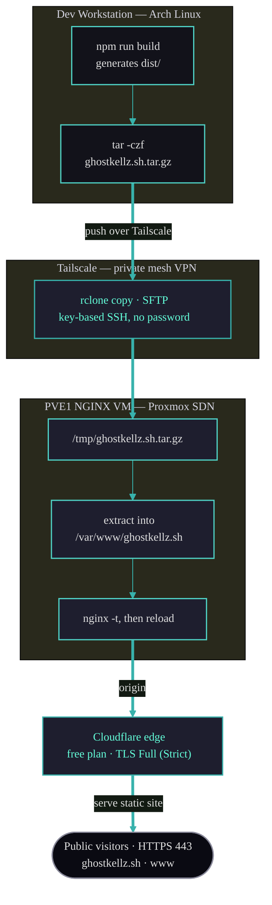
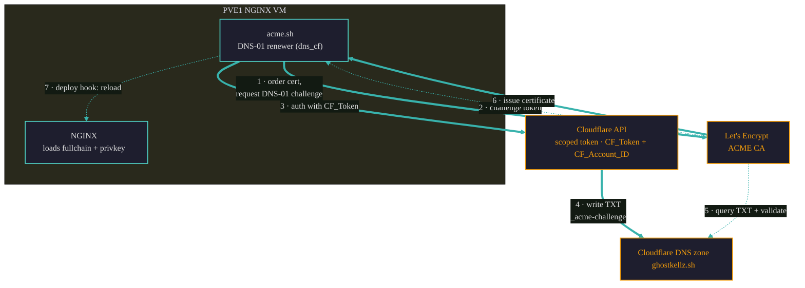

# Deployment

The site builds to static files and is served by NGINX over HTTPS on a **PVE1 bare-metal cloud
node — an NGINX VM on the Proxmox SDN** — fronted by **Cloudflare** (see
[cloudflare.md](cloudflare.md)). There is no application runtime to deploy or keep running. All
administrative access to the host happens over a private Tailscale network — SSH is never
exposed to the public internet.

## Overview

| | |
|---|---|
| **Build output** | `dist/` (static HTML/CSS/JS) |
| **Package manager** | npm (`npm run build`) |
| **Transfer** | `tar.gz` archive copied via `rclone` over SSH (SFTP) |
| **Transport** | Tailscale (private mesh VPN, key-based SSH, no password) |
| **Host** | PVE1 NGINX VM on the Proxmox SDN (static site hosting) |
| **Edge** | Cloudflare (standard / free plan) |
| **Web root** | `/var/www/ghostkellz.sh` |
| **Domains** | `ghostkellz.sh`, `www.ghostkellz.sh` |
| **TLS** | acme.sh + Let's Encrypt, DNS-01 validation via Cloudflare API token |
| **Certs** | `/etc/nginx/certs/ghostkellz.sh/fullchain.pem` + `privkey.pem` |
| **Identity files** | `/ghostkellz_pubkey.asc` and `/.well-known/openpgpkey/hu/<hash>` |

## Pipeline



Public visitors reach the site over HTTPS (443) through Cloudflare; Cloudflare proxies to the
NGINX origin on the PVE1 VM. The deploy and management path is entirely private: the workstation
connects to the VM by its Tailscale address using key-based SSH, so port 22 is never published
to the internet. See [security.md](security.md) for the full network posture and the CrowdSec
setup.

## Build

```bash
npm run build
```

This produces a complete static site in `dist/`, including the identity assets copied verbatim
from `public/`: the armored key `ghostkellz_pubkey.asc` and the WKD binary under
`.well-known/openpgpkey/hu/`.

## Transfer & Deploy

Archive the build and push it to the VM with `rclone` over its SSH/SFTP backend (the remote
points at the VM's Tailscale hostname and uses key-based auth):

```bash
# 1. Build and archive
npm run build
tar -czf ghostkellz.sh.tar.gz -C dist .

# 2. Copy to the VM over Tailscale (rclone SFTP remote)
rclone copy ghostkellz.sh.tar.gz gkvm:/tmp/

# 3. On the VM: extract into the web root
ssh gkvm '
  sudo rm -rf /var/www/ghostkellz.sh/* &&
  sudo tar -xzf /tmp/ghostkellz.sh.tar.gz -C /var/www/ghostkellz.sh/ &&
  rm /tmp/ghostkellz.sh.tar.gz
'
```

`gkvm` is the Tailscale host (configured both as an `rclone` SFTP remote and an SSH host alias).
Because SSH is key-based and Tailscale-only, no passwords or public ingress are involved. Clean
up the local `ghostkellz.sh.tar.gz` after deploying.

> After deploying a **key change**, remember to purge the Cloudflare cache for
> `/ghostkellz_pubkey.asc` and the WKD path so visitors fetch the new key. See
> [cloudflare.md](cloudflare.md#caching--the-well-known-path) and
> [gpg.md](gpg.md#renewal-procedure).

## NGINX Configuration

The reference server block lives in `archive/ghostkellz.conf`. Install it once:

```bash
sudo cp archive/ghostkellz.conf /etc/nginx/sites-available/ghostkellz.sh.conf
sudo ln -s /etc/nginx/sites-available/ghostkellz.sh.conf /etc/nginx/sites-enabled/
sudo nginx -t && sudo systemctl reload nginx
```

After any future config change:

```bash
sudo nginx -t && sudo systemctl reload nginx
```

### What the config does

- **HTTP → HTTPS redirect** for `ghostkellz.sh` and `www.ghostkellz.sh`, with an exception for
  the ACME challenge path (`/.well-known/acme-challenge/`).
- **TLS 1.2/1.3** with `HIGH:!aNULL:!MD5` ciphers, server-preferred, plus an SSL session cache.
- **Security headers:** `X-Frame-Options: SAMEORIGIN`, `X-Content-Type-Options: nosniff`,
  `X-XSS-Protection: 1; mode=block`, `Referrer-Policy: strict-origin-when-cross-origin`.
- **Gzip** for text assets.
- **WKD (`/.well-known/openpgpkey/`)** — served with `default_type application/octet-stream`
  and `Access-Control-Allow-Origin: *` so GPG clients can fetch the binary key cross-origin via
  WKD. `try_files $uri =404`.
- **`.asc` files** — served with `default_type text/plain` and
  `Content-Disposition: attachment` so the armored key downloads cleanly.
- **Astro assets (`/_astro/`)** — 1-year `immutable` cache (hashed filenames).
- **`/assets/`** — 7-day cache for images/branding.
- **Favicons (`.ico`/`.svg`)** — 30-day cache.
- **Main site** — `try_files $uri $uri/ =404`.

#### WKD + .asc location blocks (from `archive/ghostkellz.conf`)

```nginx
# OpenPGP WKD - Web Key Directory
location /.well-known/openpgpkey/ {
    default_type application/octet-stream;
    add_header Access-Control-Allow-Origin "*";
    try_files $uri =404;
}

# GPG public key file
location ~* \.asc$ {
    default_type text/plain;
    add_header Content-Disposition "attachment";
    try_files $uri =404;
}
```

These two blocks are what make the identity site work: the first serves the binary WKD key with
the correct MIME type and CORS for `gpg --locate-keys`; the second serves the armored key as a
clean download. See [gpg.md](gpg.md) for how clients consume them.

## TLS Certificates

Certificates are issued and renewed automatically with
[acme.sh](https://github.com/acmesh-official/acme.sh) against Let's Encrypt, using **DNS-01**
validation through the **Cloudflare API** (`dns_cf`):

- A single certificate covers `ghostkellz.sh` and `www.ghostkellz.sh`.
- DNS-01 (rather than HTTP-01) means the challenge is satisfied by creating TXT records in the
  Cloudflare zone — no inbound HTTP exposure is needed to validate, which suits the locked-down
  network posture.
- acme.sh authenticates to Cloudflare via a **least-privilege API token** scoped to the
  `ghostkellz.sh` zone. The credentials live in acme.sh's environment on the VM (`CF_Token` and
  `CF_Account_ID`) and are never committed to this repo.
- Renewals are automatic (acme.sh cron); the deploy hook reloads NGINX after a new cert is
  installed.

### DNS-01 Flow



The challenge is proven entirely over outbound calls and DNS records — Let's Encrypt only ever
reads a public TXT record, so the VM needs no inbound HTTP for validation.

### Cloudflare DNS Setup (one-time)

To let acme.sh prove domain control via DNS-01, create a scoped Cloudflare API token, then
point acme.sh at it.

1. In the Cloudflare dashboard, create an API token (**My Profile → API Tokens → Create
   Token**) using the *Edit zone DNS* template, scoped to **only** the `ghostkellz.sh` zone:

   | Permission | Scope |
   |------------|-------|
   | Zone · DNS · Edit | `ghostkellz.sh` |
   | Zone · Zone · Read | `ghostkellz.sh` |

   This is least-privilege: the token can edit DNS records in this one zone and nothing else.

2. Export the credentials in acme.sh's environment on the VM (keep them out of the repo):

   ```bash
   export CF_Token="<scoped-api-token>"
   export CF_Account_ID="<cloudflare-account-id>"
   ```

3. Issue the certificate covering both names:

   ```bash
   acme.sh --issue --dns dns_cf \
     -d ghostkellz.sh \
     -d www.ghostkellz.sh
   ```

4. Install it where NGINX reads, with a reload hook so renewals take effect automatically:

   ```bash
   acme.sh --install-cert -d ghostkellz.sh \
     --key-file       /etc/nginx/certs/ghostkellz.sh/privkey.pem \
     --fullchain-file /etc/nginx/certs/ghostkellz.sh/fullchain.pem \
     --reloadcmd      "sudo nginx -t && sudo systemctl reload nginx"
   ```

acme.sh installs a cron entry during setup, so subsequent renewals (and the NGINX reload) run
unattended.

The certificate paths NGINX reads from:

```
/etc/nginx/certs/ghostkellz.sh/fullchain.pem
/etc/nginx/certs/ghostkellz.sh/privkey.pem
```

> This origin certificate also backs Cloudflare's **TLS Full (Strict)** mode at the edge — see
> [cloudflare.md](cloudflare.md#tls--origin-certificate).

## Access & Network Posture

- **Tailscale** provides a private mesh network between the dev workstation and the PVE1 NGINX
  VM. All SSH and deploy traffic rides this overlay.
- **SSH** uses key-based authentication only (no password auth). Port 22 is not exposed to the
  public internet — the VM is reachable for administration only via its Tailscale address.
- **Public ingress** is limited to the web traffic Cloudflare forwards to NGINX over HTTPS. The
  PVE firewall is default-deny except 443.

See [security.md](security.md) for the trust planes, CrowdSec topology, and observability stack
that protect this host alongside the other CK sites.
