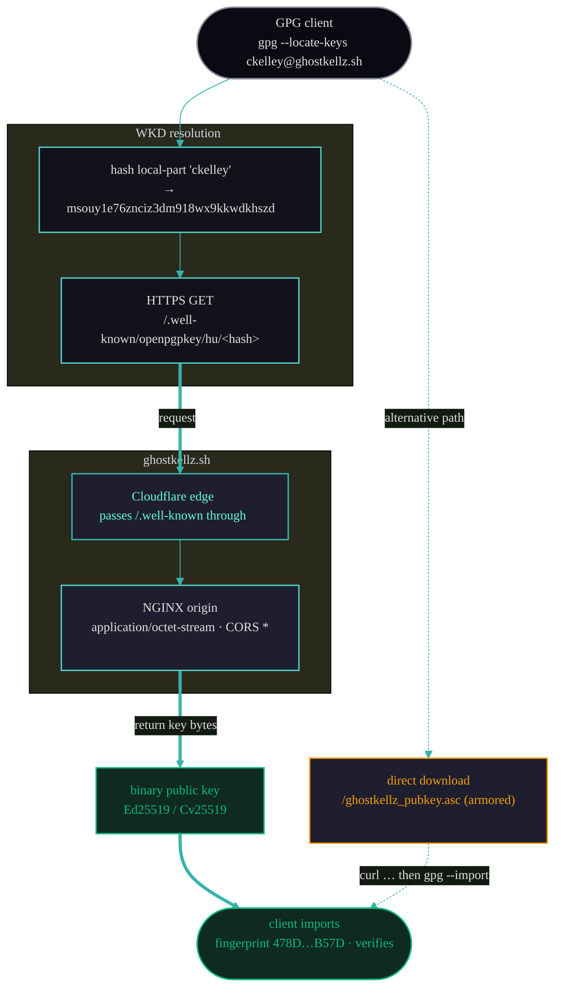

# GPG Identity

`ghostkellz.sh` exists to publish and let anyone verify the **official GhostKellz GPG public
key**. This document is the canonical reference for the key facts, how the key is discovered
(WKD and direct download), how it is published across services, how it is renewed, and how a
visitor verifies it.

## Key Facts

| Field | Value |
|-------|-------|
| **UID** | `GhostKellz <ckelley@ghostkellz.sh>` |
| **Fingerprint** | `478D3EFD1D9694F6BAD0AC1F777538754BA2B57D` |
| **Key ID** (long) | `777538754BA2B57D` |
| **Primary key algorithm** | Ed25519 (sign / certify) |
| **Encryption subkey** | Cv25519 (encrypt) |
| **Created** | 2025-04-11 |
| **Expires** | **2027-04-05** (see reconciliation note below) |
| **Owner** | Christopher Kelley (GhostKellz) |
| **Armored key** | https://ghostkellz.sh/ghostkellz_pubkey.asc |
| **WKD lookup** | `gpg --locate-keys ckelley@ghostkellz.sh` |

> **Expiry reconciliation.** The legacy `archive/GPG_RENEWAL.md` checklist lists a *Current
> Expiry* of **2026-04-11** — that document is the **pre-renewal** checklist describing the
> original 1-year expiry of the 2025-04-11 key. The key has since been renewed: the live site
> source authoritatively shows **`2027-04-05`** in two independent places —
> `src/pages/index.astro` (Key Details → *Expires*) and `src/components/Terminal.astro` (the
> `gpg --locate-keys` sample output, `[expires: 2027-04-05]`). The published armored key
> (`public/ghostkellz_pubkey.asc`) and the WKD binary carry a **renewed self-signature** (its
> binding signature was re-created after the original key, consistent with an `expire`/`save`
> renewal), so the original 2026-04-11 expiry no longer applies. **The reconciled, current value
> is `2027-04-05`.** Always confirm the live value with `gpg --list-keys` after import.

The fingerprint is the immutable identity. Renewing the expiry does **not** change the
fingerprint or key ID — existing signatures and verified commits remain valid.

## How the Key Is Published

The same key material is published through several independent channels so it can be
cross-checked:

| Channel | Form | Location |
|---------|------|----------|
| **Site download** | ASCII-armored | `https://ghostkellz.sh/ghostkellz_pubkey.asc` |
| **WKD (advanced/direct)** | Binary | `https://ghostkellz.sh/.well-known/openpgpkey/hu/msouy1e76znciz3dm918wx9kkwdkhszd` |
| **DNS** | Base64 TXT | Cloudflare DNS record under `_openpgpkey.ghostkellz.sh` (WKD hash variant) |
| **GitHub** | ASCII-armored | Account *Settings → SSH and GPG keys* (key `777538754BA2B57D`) |
| **GitLab** (if used) | ASCII-armored | Account GPG keys |

Publishing through multiple channels means a verifier who distrusts one path (say, a cached
`.asc`) can independently confirm via WKD or DNS.

## Web Key Directory (WKD)

WKD lets a mail/GPG client find a key automatically from just the email address, with no
keyserver. `ghostkellz.sh` uses the **advanced (direct) method**: the key is served from the
domain's own `.well-known` tree.

### Layout

The local-part `ckelley` is hashed (SHA-1, z-base-32 encoded) to produce the lookup filename:

```
public/.well-known/openpgpkey/hu/msouy1e76znciz3dm918wx9kkwdkhszd
```

- The file is the **binary** (non-armored) public key.
- NGINX serves the `/.well-known/openpgpkey/` path with `default_type application/octet-stream`
  and `Access-Control-Allow-Origin: *` so clients can fetch it cross-origin (see
  [deployment.md](deployment.md#nginx-configuration)).
- The hash `msouy1e76znciz3dm918wx9kkwdkhszd` corresponds to the local-part `ckelley`.

### WKD Lookup Flow



1. The client hashes the local-part of `ckelley@ghostkellz.sh` to the z-base-32 filename.
2. It issues an HTTPS `GET` to `/.well-known/openpgpkey/hu/<hash>` on `ghostkellz.sh`.
3. Cloudflare passes the `.well-known` request through to the NGINX origin, which returns the
   **binary** key with the correct MIME type and CORS header.
4. The client imports the key and can confirm the fingerprint `478D…B57D`.

The **direct `.asc` download** path (`curl -sL …/ghostkellz_pubkey.asc | gpg --import`) is the
manual alternative shown on the page for anyone who prefers to fetch the armored key by URL.

## Verification Commands

These are the commands surfaced on the site (the "How to Verify" cards) plus the confirmation
steps a careful verifier should run.

```bash
# 1. Import via WKD (no keyserver needed)
gpg --locate-keys ckelley@ghostkellz.sh

# 2. Import from the armored URL
curl -sL https://ghostkellz.sh/ghostkellz_pubkey.asc | gpg --import

# 3. Confirm the fingerprint matches the published value
gpg --fingerprint ckelley@ghostkellz.sh
# expect: 478D 3EFD 1D96 94F6 BAD0  AC1F 7775 3875 4BA2 B57D

# 4. Verify a detached signature against a file
gpg --verify file.sig file
```

A "Good signature from GhostKellz <ckelley@ghostkellz.sh>" line, with the fingerprint matching
the value above, confirms the artifact was signed by this identity.

## Renewal Procedure

Summarized from `archive/GPG_RENEWAL.md`. Renewing extends the expiry **without** changing the
fingerprint, so previously verified commits and signatures stay valid.

### 1. Extend the expiration

```bash
gpg --edit-key 478D3EFD1D9694F6BAD0AC1F777538754BA2B57D
# at the gpg> prompt:
#   expire        -> set new expiry on the primary key (e.g. 1y / 2y)
#   key 1         -> select the encryption subkey
#   expire        -> set new expiry on the subkey
#   save
```

### 2. Export all three formats

```bash
# ASCII-armored — for the site .asc and the inline KeyBlock
gpg --armor --export ckelley@ghostkellz.sh > public/ghostkellz_pubkey.asc

# Binary — for the WKD .well-known file
gpg --export ckelley@ghostkellz.sh > public/.well-known/openpgpkey/hu/msouy1e76znciz3dm918wx9kkwdkhszd

# Base64 — for the Cloudflare DNS TXT record
gpg --export ckelley@ghostkellz.sh | base64 -w 0
```

### 3. Update the site files

- `public/ghostkellz_pubkey.asc` (armored).
- `public/.well-known/openpgpkey/hu/msouy1e76znciz3dm918wx9kkwdkhszd` (binary).
- `src/components/KeyBlock.astro` — replace the inline armored `publicKey` constant.
- `src/pages/index.astro` — update the **Key Details** *Expires* value.
- `src/components/Terminal.astro` — update the `[expires: …]` text in the sample output.

Then rebuild and deploy (`npm run build`; see [deployment.md](deployment.md)).

### 4. Update Cloudflare DNS (WKD hash TXT)

Update the base64 TXT record under `_openpgpkey.ghostkellz.sh` (split into 255-char chunks if
needed) with the new export from step 2. The WKD local-part hash is stable:

```bash
# z-base-32 hash of the local-part 'ckelley'
echo -n "ckelley" | sha1sum   # hashed + z-base-32 encoded -> msouy1e76znciz3dm918wx9kkwdkhszd
```

### 5. Re-upload to external services

GitHub has no "edit" — **delete** the old key (`777538754BA2B57D`) and **add** the updated
export. Existing verified commits stay verified because the fingerprint is unchanged. Repeat for
GitLab if used.

```bash
gpg --armor --export ckelley@ghostkellz.sh | xclip -selection clipboard
```

### 6. Deploy & verify

```bash
# deploy the rebuilt static site (see deployment.md), then:

# purge the Cloudflare cache for the key + WKD so visitors get the new key
#   (cloudflare.md#caching--the-well-known-path)

# verify WKD returns the renewed key
gpg --locate-keys ckelley@ghostkellz.sh

# verify DNS propagation
dig +short TXT _openpgpkey.ghostkellz.sh
```

After renewal, confirm `gpg --list-keys` shows the new expiry and update any documentation that
quotes the expiry (this file's Key Facts table and [content.md](content.md#identity-details)).
